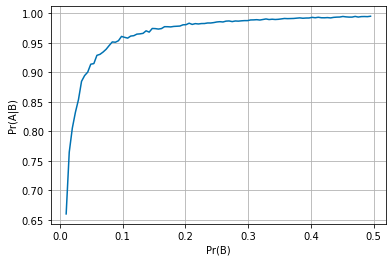

#Genetic Disorder Testing Simulation</h1>
(book #1.13) A medical company touts its new test for a certain genetic disorder. The false negative rate is small: if
you have the disorder, the probability that the test returns a positive result is 0.999. The false positive rate is also
small: if you do not have the disorder, the probability that the test returns a positive result is only 0.005. Assume
that 2% of the population has the disorder. If a person chosen uniformly from the population is tested and the result
comes back positive, what is the probability that the person has the disorder?

```python
from simulations.genetic_disorder.experiments import GeneticDisorderTestingExperiment

# create a new experiment with the parameters specified in problem 1.13
_experiment = GeneticDisorderTestingExperiment(
    p = 0.02,
    sens = 0.999,
    spec = 1-0.005,
    n = 100000
)

# and run it
_experiment.run_simulation()
```
```
[1] 0.8038585209003215
```
To observe how Pr(B|A) changes as a function of Pr(B), we iterate over a loop:
```python
import matplotlib.pyplot as plt
import numpy as np

%matplotlib inline
plt.style.use('seaborn-colorblind')

def plot_prob_range(start=0.01, stop=0.5, steps=100):
    y = list()
    p_range = np.arange(start, stop, (stop-start)/steps)
    for p in p_range:
        _experiment.p = p
        y.append(_experiment.run_simulation())

    fig, ax = plt.subplots()
    ax.plot(p_range, y, label='Pr(A|B)')

    ax.set(xlabel='Pr(B)', ylabel='Pr(A|B)')
    ax.grid()
    plt.show()

print('Let A = "Has a genetic Disorder"')
print('Let B = "Test result is positive"')
plot_prob_range()
```


`TODO: If there is time, I'll look into creating a slider for the visualization.`

Source code of `GeneticDisorderTestingExperiment`

```python
import numpy as np
import pandas as pd


class GeneticDisorderTestingExperiment:
    """ For the simulation we define two events, A and B (Note that I switched the order of A and B from the HW
    instructions for convenience):
        Let A = "Has a genetic Disorder"; P(A) = parameter p (default to 0.02) key: genetic_disorder
        Let B = "Test result is positive"  key: positive_test

    Args:
        :param float p: Probability of an individual within the population of having the genetic disorder
        :param int n: Sample size | Number of hypothetical subjects
        :param float sens: Probability of the test returning a positive result if the subject has the disorder
        :param float spec: Probability of the test returning a negative result if the subject doesn't have the disorder
    """
    _sample: pd.Series = None
    _test_results: pd.Series = None

    def __init__(self, p: float = 0.02, n: int = 10000, sens: float = 0.999, spec: float = 0.995):
        self.p = p
        self.n = n
        self.sens = sens
        self.spec = spec

    def _generate_sample(self, p: float = None, n: int = None) -> pd.Series:
        """ Generate a sample of test subjects indicating if they have a genetic disorder, based on parameters.

        :param float p: Probability of an individual within the population of having the genetic disorder
        :param int n: Sample size | Number of hypothetical subjects
        :return pd.Series:
        """
        self.p = p if p is not None else self.p
        self.n = n if n is not None else self.n
        return pd.Series(np.random.choice((True, False),
                                          size=self.n,
                                          p=(self.p, 1 - self.p),
                                          replace=True),
                         name='genetic_disorder')

    def resample(self, p: float = None, n: int = None) -> None:
        self._sample = self._generate_sample(p, n)

    def run_simulation(self) -> float:
        """ The simulation will generate a sample of individuals, then will simulate the testing results, and finally
        will compute the probability of the subjects having the disorder based on the test results.

        :return float: Empirical calculation of P(B|A)
        """
        self._sample = self._generate_sample()
        self._test_results = self.apply_test()
        n_ab = (self._sample & self._test_results).sum()
        n_b = self._test_results.sum()
        return n_ab / n_b

    def apply_test(self) -> pd.Series:
        """ Simulates a test to the sample of subjects. Use class defined sensitivity and specificity attributes.

        :return pandas.Series: Tests results. Values in {0, 1} for negative and positive respectively.
        """
        _pd_data = {
            'sample': self._sample,
            'test_result': pd.Series(np.random.uniform(size=self.n))
        }

        _test_df = pd.DataFrame(data=_pd_data)
        _test_df['positive_test'] = False

        # Pr(positive_test | has genetic disorder)
        _test_df['positive_test'].mask(_test_df['sample'] == 1, _test_df['test_result'] < self.sens, inplace=True)
        # Pr(positive_test | doesn't have genetic disorder)
        _test_df['positive_test'].mask(_test_df['sample'] == 0, _test_df['test_result'] < (1-self.spec), inplace=True)

        return _test_df['positive_test']

```